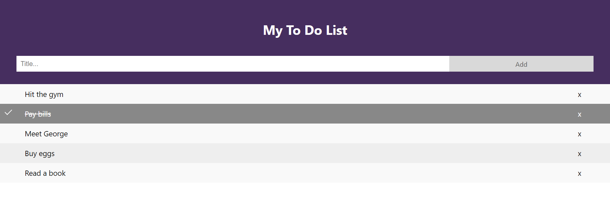

# Todo List Application

A simple TODO list application built using React and Redux. Users can add tasks, mark them as complete, and delete unwanted tasks.

## Table of Contents

- [Features](#features)
- [Installation](#installation)
- [Usage](#usage)

## Features


<br/>
- Add new tasks to the list.
- Mark tasks as complete.
- Delete unwanted tasks.

## Installation

1. Clone the repository:

   ```bash
   git clone https://github.com/your-username/todo-list-react-redux.git
   cd todo-list-react-redux
   ```
2. Install dependencies:
    ```
   npm install
    ```
3. Start the development server:
    ```
   npm start
    ```

## Usage
1. Open your browser and go to http://localhost:3000.
2. Enter a task in the input field and click "Add" to add a new task.
3. Click on the task to mark it as complete.
4. Click the Delete icon (X) button next to a task to remove it from the list.